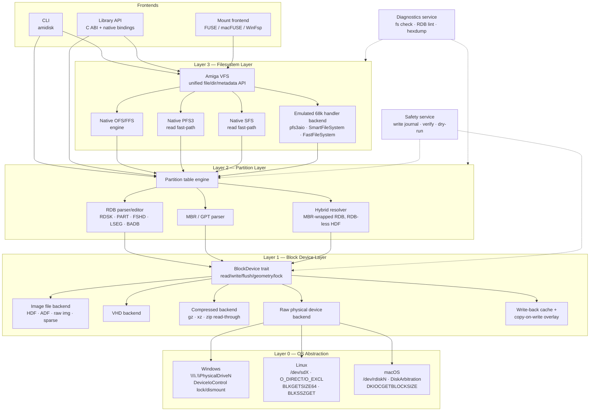
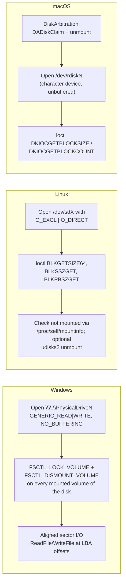
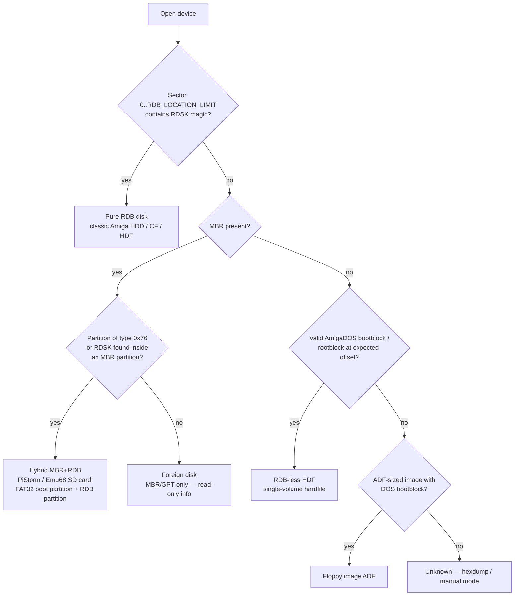
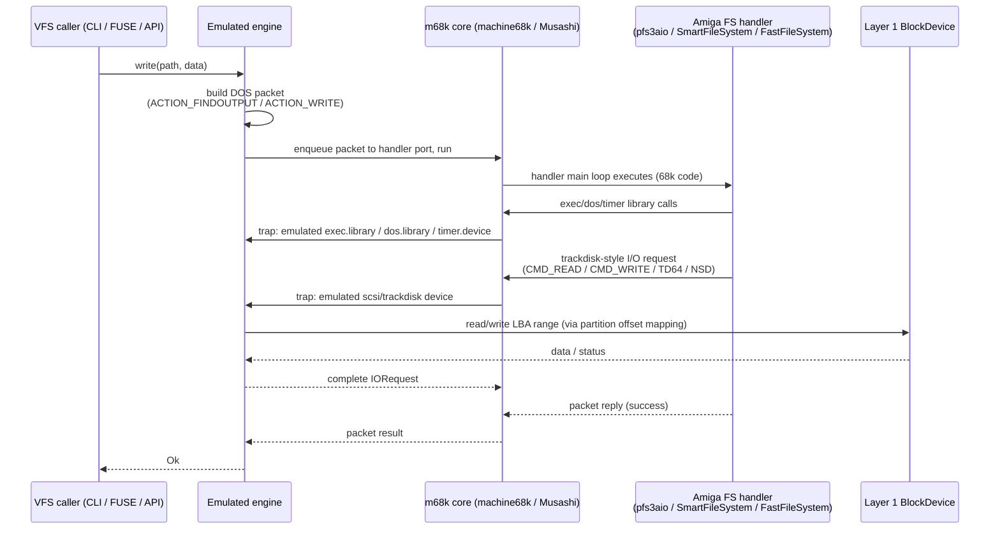
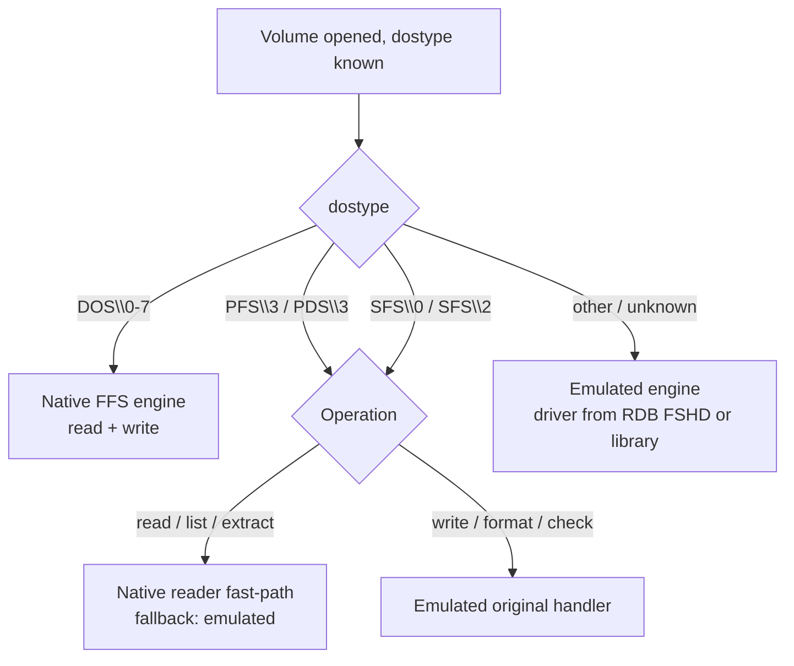

# AmigaDisk Toolkit — Architecture Document

**Status:** Draft v0.1
**Scope:** Cross-platform tool and library for reliable read/write access to Amiga HDF images and directly-attached physical disks, with full RDB (Rigid Disk Block) partition management and support for all mainstream Amiga filesystems (OFS, FFS, PFS3, SFS) on modern host operating systems (Windows, macOS, Linux).

---

## 1. Goals and Non-Goals

### 1.1 Goals

- Read **and write** Amiga media reliably: HDF/ADF image files, VHD images, and raw physical devices (CF cards, SD cards, IDE/SATA/SCSI disks via USB bridges or native controllers).
- First-class **RDB** support: parse, create, edit, resize, backup/restore, partition CRUD, embedded filesystem (`FSHD`/`LSEG`) management.
- Support hybrid layouts that are now common in the field: **MBR-wrapped RDB** (PiStorm / Emu68 SD cards), RDB-less single-volume HDFs, and plain floppy ADFs.
- Filesystem access (list / read / write / format / check) for **OFS, FFS (DOS\0–\7), PFS3 (PFS\3, PDS\3), SFS (SFS\0, SFS\2)**.
- Deterministic, verifiable, *safe* writes to physical media (locking, dismounting, verification passes, dry-run mode).
- One codebase, three OSes: Windows, macOS, Linux (x86-64 and ARM64).
- Usable as a **library** (embeddable in emulators, GUI tools, agents) and as a **CLI**.

### 1.2 Non-Goals (for v1)

- Flux-level floppy formats (IPF, SCP, Greaseweazle capture) — out of scope; ADF only.
- AmigaOS 4 / MorphOS filesystems (SFS2 64-bit variants, JXFS).
- GUI (the architecture must not preclude one; CLI + library first).

---

## 2. Prior Art and Source Repositories

The design deliberately builds on proven open-source implementations rather than starting from scratch. Each project below is either a **code donor**, a **reference specification in code**, or a **validation oracle**.

| Project | Language | Repo | What it gives us |
|---|---|---|---|
| **amitools** (`rdbtool`, `xdftool`) | Python | https://github.com/cnvogelg/amitools | Cleanest readable implementation of RDB block structures, OFS/FFS, block device abstraction (`RawBlockDevice`, `ImageFile`, `DiskGeometry`). Reference spec in code. |
| **hst-imager** | C# / .NET | https://github.com/henrikstengaard/hst-imager | Closest existing tool to our goal: physical drive I/O on Win/macOS/Linux, GPT/MBR/RDB parsing, partition import/export, PiStorm RDB paths, sparse files, `.vhd` support, disk-level caching layer. |
| **hst-amiga** | C# / .NET | https://github.com/henrikstengaard/hst-amiga | Library-level RDB + **FFS** + **PFS3** read/write/format implementations; UAEFSDB / UAE metafile handling. |
| **AmiFUSE** | Python + m68k emu | https://github.com/reinauer/AmiFUSE | Runs *original* Amiga filesystem handlers (pfs3aio, SmartFileSystem, FastFileSystem, CDFileSystem, BFFS) under m68k emulation, bridged to FUSE/WinFSP. The "bit-perfect oracle" strategy. |
| **WinUAE** (`hardfile.cpp`, `filesys.cpp`, `blkdev*.cpp`) | C++ | https://github.com/tonioni/WinUAE | Battle-tested RDB parsing, geometry heuristics, `uaehf.device` semantics, Windows raw physical-drive access (real CF/HDD mounting). |
| **FS-UAE** | C/C++ | https://github.com/FrodeSolheim/fs-uae | Cross-platform port of the UAE hardfile/filesys layer; POSIX raw-device access patterns. |
| **Amiberry** | C++ | https://github.com/BlitterStudio/amiberry | Same UAE lineage on ARM/Linux; useful for ARM64 quirks. |
| **ADFlib** | C99 | https://github.com/adflib/ADFlib | Portable, actively maintained OFS/FFS implementation with strong hardening against corrupted/malicious filesystem structures; experimental native-device access (Win/Linux). |
| **pfs3aio** | m68k C | https://github.com/tonioni/pfs3aio | Canonical PFS3 source (maintained by Toni Wilen). Spec for a native PFS3 reimplementation *and* the handler binary consumed by the emulated-handler backend. |
| **AROS** | C | https://github.com/aros-development-team/AROS | Portable C reimplementations of AmigaOS DOS packet layer, FFS and SFS handlers — a second reference implementation for SFS semantics. |
| **Linux kernel** (`fs/affs`, `block/partitions/amiga.c`) | C | https://github.com/torvalds/linux/tree/master/fs/affs | In-kernel FFS/OFS read-write driver and RDB partition parser. Primary **validation oracle** on Linux (`losetup -P` on an HDF exposes RDB partitions). |
| **machine68k** | C/Python | https://github.com/cnvogelg/machine68k | Musashi-based 68k CPU emulation package used by amitools/AmiFUSE — the engine for the emulated-handler backend. |
| **Musashi** | C | https://github.com/kstenerud/Musashi | Underlying portable 68k core. |
| **DiscUtils** | C# | https://github.com/DiscUtils/DiscUtils | Virtual disk container zoo (VHD/VHDX/VMDK) and host filesystems (FAT, ext) — used by hst-imager; relevant if the .NET path is chosen. |
| **adf-tools** | Scala/Java | https://github.com/weiju/adf-tools | Independent OFS/FFS implementation; useful for cross-checking edge cases. |
| **libfuse** | C | https://github.com/libfuse/libfuse | Linux mount frontend. |
| **macFUSE** | C | https://github.com/macfuse/macfuse | macOS mount frontend. |
| **WinFsp** | C | https://github.com/winfsp/winfsp | Windows mount frontend. |

Format documentation: Laurent Clévy's ADF/filesystem FAQ (http://lclevy.free.fr/adflib/adf_info.html), *Guru Book* chapters 9/10/15, RDB spec in AmigaOS NDK (`devices/hardblocks.h`).

---

## 3. High-Level Architecture

The system is organized as four strictly layered subsystems plus two cross-cutting services. Every layer talks only to the layer directly below through a narrow trait/interface, so backends are swappable and independently testable.



### 3.1 Key architectural decision: hybrid filesystem strategy

There are two viable strategies for filesystem support, and the industry prior art splits cleanly between them:

**Strategy A — native reimplementation** (hst-amiga, ADFlib, Linux affs): fast, embeddable, no emulation dependency — but every filesystem is a multi-month correctness project, and *write* support for PFS3 (with its deferred reorganization logic) and SFS (with its transaction/rollback machinery) carries real data-corruption risk if subtle semantics diverge from the original handlers.

**Strategy B — emulated original handlers** (AmiFUSE): run the actual m68k handler binaries under CPU emulation, speak the AmigaDOS packet protocol to them, and route their `trackdisk`-style block I/O to our Layer 1. Correct by construction — it is literally the same code that ran on the Amiga — but slower and heavier.

**This design adopts a hybrid:**

| Filesystem | Read path | Write path | Rationale |
|---|---|---|---|
| OFS / FFS | Native | Native | Simple, fully documented, three independent open implementations to cross-check; Linux `affs` as oracle. |
| PFS3 | Native (fast) with fallback to emulated | **Emulated pfs3aio handler** (native write is a later milestone) | PFS3 on-disk reorg semantics are intricate; the handler is canonical and maintained. |
| SFS | Native (fast) with fallback to emulated | **Emulated SmartFileSystem handler** | Same argument; AROS SFS source is the spec for a future native writer. |
| RDB itself | Native | Native | Block-structured, well documented, straightforward. |

The emulated backend is not a bolt-on: it is a first-class Layer 3 engine behind the same VFS trait, so callers never know which engine served the request. This also future-proofs the tool — any exotic handler (BFFS, CDFileSystem for ISO, third-party filesystems shipped in an RDB `FSHD`) works day one via emulation.

---

## 4. Layer 0/1 — Block Device Layer

### 4.1 BlockDevice abstraction

Everything above Layer 1 sees a single trait:

```
trait BlockDevice {
    fn geometry(&self) -> Geometry;        // cyl/heads/secs if known, else LBA-only
    fn sector_size(&self) -> u32;          // physical + logical (may differ: 4Kn drives!)
    fn size_bytes(&self) -> u64;
    fn read(&self, lba: u64, buf: &mut [u8]) -> Result<()>;
    fn write(&mut self, lba: u64, buf: &[u8]) -> Result<()>;
    fn flush(&mut self) -> Result<()>;
    fn lock_exclusive(&mut self) -> Result<LockGuard>;   // no-op for image files
    fn kind(&self) -> DeviceKind;          // Image | Vhd | Physical | Overlay
}
```

Design points learned from prior art:

1. **Sector size is not always 512.** RDBs on real Amigas are 512-byte, but modern USB bridges expose 4K logical sectors, and RDB itself supports larger block sizes for big disks. The layer must translate between RDB `BlockBytes` and host logical sector size (WinUAE's `hardfile.cpp` handles this translation and is the reference).
2. **Geometry is advisory.** Derive CHS from the RDB when present (RDB is authoritative for the Amiga side); synthesize amitools-compatible geometry heuristics when creating new RDBs.
3. **Sparse allocation** for new images (hst-imager does this by default; NTFS/APFS/ext4 all support it).
4. **Copy-on-write overlay device**: every mutating session can be run against an overlay (journal file of dirty blocks) that is atomically committed to the base device only after verification. This single mechanism provides dry-run, crash safety, and undo.

### 4.2 Raw physical device access per OS



Reference implementations to mine: **hst-imager** (`Hst.Imager.Core` physical drive managers for all three OSes, including its retry-on-open logic and the kernel32-based Windows drive enumeration that replaced WMI), **WinUAE** `blkdev_cd_ioctl/hardfile` Windows path, **FS-UAE/Amiberry** POSIX path, **ADFlib** `adf_dev_driver_nativ_*` (Linux/Windows native device drivers).

Safety policy (configurable, default-on): refuse to open the boot/system disk; require `--force` for any non-removable device; hst-imager's "USB-only" filter is available as a strict mode but not hard-coded.

---

## 5. Layer 2 — Partition Layer

### 5.1 Supported on-disk layouts



Note: per the RDB specification, the `RDSK` block may live anywhere in the first 16 blocks of the device — the scanner must check the full window, not just LBA 0 (a classic interop bug; both amitools and WinUAE scan the window).

### 5.2 RDB engine capabilities

Modeled on the union of amitools `rdbtool` and hst-imager `rdb` commands:

- Parse/serialize all block types: `RDSK`, `PART`, `FSHD`, `LSEG`, `BADB` with checksum validation and repair.
- Partition CRUD: add, delete, move, resize, kill/restore (undelete), copy between disks, export to / import from partition-only HDF.
- `DosEnvec` editing: MaxTransfer, Mask, Buffers, BootPri, flags, block size — with lint rules (e.g., warn on MaxTransfer > 0x1FE00 for IDE, mask/buffer sanity, >4 GB boundary checks vs. installed filesystem capability).
- Embedded filesystem management: list/extract/add/update `FSHD`+`LSEG` driver chains (e.g., inject pfs3aio into an RDB), version comparison.
- Full-RDB backup/restore to a compact file (the write-journal of Layer 1 makes restore atomic).
- Geometry recalculation ("adjust") after image resize — matching `rdbtool resize/adjust` semantics.

---

## 6. Layer 3 — Filesystem Layer

### 6.1 Unified VFS

All engines implement one trait, so the CLI, library API and FUSE frontend are engine-agnostic:

```
trait AmigaVolume {
    fn info(&self) -> VolumeInfo;                       // dostype, label, used/free
    fn list(&self, path: &AmigaPath) -> Vec<DirEntry>;  // incl. protection bits, comment, ds-ticks mtime
    fn read(&self, path: &AmigaPath) -> impl Read;
    fn write(&mut self, path: &AmigaPath, data: impl Read, meta: Metadata) -> Result<()>;
    fn mkdir / delete / rename / set_meta ...
    fn format(&mut self, dostype: DosType, label: &str) -> Result<()>;
    fn check(&self, level: CheckLevel) -> FsReport;     // validate structures
}
```

Amiga-specific metadata (HSPARWED protection bits, file comments, 1/50 s timestamps, international/dircache mode) is preserved end-to-end. On extraction to host filesystems, metadata round-trips through sidecar conventions already established in the ecosystem: **`.uaem`** metafiles (FS-UAE), **UAEFSDB** (WinUAE), and amitools **`.xdfmeta`** — all three read/write, selectable per operation (hst-amiga already implements the first two and serves as reference).

### 6.2 Native engines

- **OFS/FFS engine** — ported/re-derived from three mutually cross-checked sources: amitools `amitools.fs` (structure clarity), ADFlib (corruption hardening: loop detection in directory chains, refuse-to-mount-rw on invalid volumes, remount-ro-then-repair workflow), and Linux `fs/affs` (behavioral oracle). Supports DOS\0–\7 including international mode, dircache and long-filename variants.
- **PFS3/SFS native readers** — implemented against pfs3aio and AROS SFS sources; read-only fast path for bulk extraction, always cross-verified against the emulated engine in CI.

### 6.3 Emulated-handler engine

The AmiFUSE architecture, embedded as a library component:



Handler binaries are sourced from the RDB itself (`FSHD`/`LSEG` extraction — a disk usually carries its own correct driver), from a local handler library, or auto-downloaded (pfs3aio releases). The handler ABI surface that must be emulated is small and already mapped out by AmiFUSE/vamos: a subset of `exec.library`, `dos.library` packet plumbing, `timer.device`, and a block device (`CMD_READ/WRITE`, `TD_READ64/WRITE64`, NSD, and HD_SCSICMD for DirectSCSI-mode PFS3).

Performance mitigations (AmiFUSE's known weakness): persistent handler process per mounted volume (no per-op startup), block-level read cache in Layer 1, batched packet pipelining, and the native read fast-path for bulk operations.

### 6.4 Engine selection



---

## 7. Cross-Cutting Services

### 7.1 Safety / reliability service

This is the "reliably" in the project's mission statement, and it is a service, not an afterthought:

1. **Write journal (COW overlay).** All mutating operations write to an overlay; commit = verified sequential flush of dirty blocks + fsync + read-back compare. Abort/crash = base device untouched.
2. **Verification modes.** Post-write read-back compare (like hst-imager `compare`), full-device checksums, and structural verification (RDB checksums, bitmap consistency, PFS3/SFS mount test via emulated handler after native writes).
3. **Exclusive locking** at Layer 0 on physical devices; advisory lockfiles for images.
4. **Dry-run** for every destructive command, rendering the exact block-level diff.
5. **Automatic pre-flight RDB backup** before any partition-table mutation.

### 7.2 Diagnostics service

RDB lint (geometry vs. size, MaxTransfer/Mask pitfalls, overlapping partitions, >4 GB boundary vs. filesystem version), filesystem check per engine, block-level hexdump/annotate mode (amitools `rdbtool show`-style block maps), and an oracle mode that mounts the same volume through two engines and diffs directory trees — used both in CI and as a user-facing "second opinion" command.

---

## 8. Frontends

- **CLI (`amidisk`)** — command families: `device` (list/info), `image` (create/convert/read/write/compare/optimize), `rdb` (info/init/part-*/fs-*/backup/restore), `fs` (dir/copy/extract/write/mkdir/delete/format/check), `mount` (FUSE/WinFsp). Composable command chaining as in amitools (`+` separated), JSON output mode for scripting/agents.
- **Library API** — core library with a stable C ABI; bindings for Python (agents, scripting) and the host language's native API.
- **Mount frontend** — libfuse (Linux), macFUSE (macOS), WinFsp (Windows), all driving the same VFS trait; read-write mounts allowed only via the journal overlay.

---

## 9. Testing Strategy

- **Golden-image corpus**: ADFlib test images (OFS/FFS incl. corrupted cases), HstWB/emu68hatcher-produced RDB images, PFS3/SFS volumes formatted by real handlers under WinUAE, PiStorm SD card dumps.
- **Differential testing**: every filesystem operation replayed against (a) the native engine, (b) the emulated handler engine, (c) where applicable, Linux kernel `affs` via loop device — trees and metadata must match bit-for-bit.
- **Round-trip property tests**: pack → unpack → pack must be idempotent (amitools' repack semantics as the model).
- **Hardware-in-the-loop**: CF/SD written by the tool must boot on real A1200/A4000 and under WinUAE/FS-UAE/Amiberry; VHD outputs must attach in WinUAE.
- **Fault injection**: kill process mid-commit; base device must remain valid (journal guarantee).

---

## 10. Risks and Open Questions

| Risk | Mitigation |
|---|---|
| Native PFS3/SFS write corruption | Deferred: writes go through emulated original handlers until the native writer passes differential CI for a full release cycle. |
| Emulated handler performance | Persistent handler sessions, L1 block cache, native read fast-paths, packet batching. |
| 4Kn USB bridges vs. 512-byte RDB | Explicit logical/physical sector translation layer; WinUAE as reference; corpus tests with synthetic 4Kn devices. |
| macOS increasingly hostile raw-disk permissions (Full Disk Access, TCC) | DiskArbitration-first flow, documented entitlements; emu68hatcher/hst-imager have working recipes. |
| Handler binaries provenance (pfs3aio versions differ in behavior) | Version detection from `LSEG` data, pinned known-good handler set, user override. |
| RDB variants in the wild (HDToolbox vs. rdbtool vs. hst-imager producers) | Lint engine + corpus of real-world RDBs; never "normalize" blocks we don't understand — preserve unknown block chains verbatim. |

Open questions for the next revision: implementation language (Rust core with C ABI vs. building directly on the .NET hst-amiga stack vs. C++ sharing UAE code), whether the emulated engine embeds machine68k (Python dependency) or links Musashi directly, and whether PFS3 DirectSCSI mode (`PDS\3`) needs full HD_SCSICMD emulation in v1.

---

## 11. Reference Index

- amitools — https://github.com/cnvogelg/amitools (docs: https://amitools.readthedocs.io)
- hst-imager — https://github.com/henrikstengaard/hst-imager
- hst-amiga — https://github.com/henrikstengaard/hst-amiga
- AmiFUSE — https://github.com/reinauer/AmiFUSE
- WinUAE — https://github.com/tonioni/WinUAE
- FS-UAE — https://github.com/FrodeSolheim/fs-uae
- Amiberry — https://github.com/BlitterStudio/amiberry
- ADFlib — https://github.com/adflib/ADFlib
- pfs3aio — https://github.com/tonioni/pfs3aio
- AROS (FFS/SFS handlers, DOS packet layer) — https://github.com/aros-development-team/AROS
- Linux affs — https://github.com/torvalds/linux/tree/master/fs/affs
- Linux Amiga partition parser — https://github.com/torvalds/linux/blob/master/block/partitions/amiga.c
- machine68k — https://github.com/cnvogelg/machine68k
- Musashi — https://github.com/kstenerud/Musashi
- DiscUtils — https://github.com/DiscUtils/DiscUtils
- adf-tools — https://github.com/weiju/adf-tools
- libfuse — https://github.com/libfuse/libfuse
- macFUSE — https://github.com/macfuse/macfuse
- WinFsp — https://github.com/winfsp/winfsp
- ADF format FAQ (Laurent Clévy) — http://lclevy.free.fr/adflib/adf_info.html
- emu68hatcher (packaging reference for PiStorm images) — https://github.com/rootrootde/emu68hatcher
